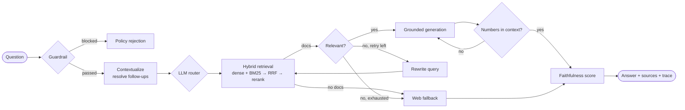

# RAG Agent with Database Routing

A RAG system that routes each question to the right domain-specific vector store, grades what it retrieves, and rewrites the query and retries when the results are weak — falling back to web search rather than answering ungrounded.

## How it works



**Ingestion:** PDF / DOCX / XLSX / PPTX / images / text → parse → consolidate chunks so tables keep their headers → embed locally (dense + sparse) → Qdrant.

## Features

- **Query routing** — an LLM picks the collection; keyword fallback if it returns bad JSON
- **Hybrid retrieval** — dense cosine + BM25 sparse, fused with reciprocal rank fusion
- **Self-correcting loop** — retrieved context is LLM-graded; weak results trigger a query rewrite and a second attempt before web fallback
- **History-aware follow-ups** — "and in 2018?" is resolved to a standalone question before routing and retrieval
- **Anti-hallucination guards** — every number in an answer must appear in the retrieved context, or it regenerates once
- **Guardrails** — prompt-injection detection on input, validation on output
- **Observability** — per-stage latency traces surfaced in the UI
- **Local embeddings** — FastEmbed, no embedding API cost

## Quick start

```bash
cp .env.example .env        # add your Groq key (or paste it in the sidebar)
uv sync
uv run streamlit run app.py # http://localhost:8501
```

Requires Python 3.10+ and a free key from [console.groq.com](https://console.groq.com).

## Tests & evaluation

```bash
uv run python -m pytest tests/ -q      # 56 unit + integration tests
uv run python tests/smoke_eval.py      # keyless regression check

bash evaluation/fetch_corpus.sh        # fetch the benchmark corpus (~232 MB)
uv run python evaluation/evaluate_pdf_module.py --label run1
uv run python evaluation/evaluate_hard.py --label hard1
uv run python evaluation/evaluate_ragas.py --source run1
```

Benchmarks checkpoint after every question, so runs resume after rate limits.

Last full run scored **85.5%** on 100 LLM-judged questions, measuring retrieval + generation against a known-correct collection. The harness now routes end-to-end instead of bypassing the router; re-baselining on the current model is pending.

## Stack

| Layer | Choice |
|---|---|
| LLM | `openai/gpt-oss-120b` via Groq |
| Embeddings | FastEmbed `BAAI/bge-small-en-v1.5` + `Qdrant/bm25` |
| Vector store | Qdrant (in-memory, or persisted via `QDRANT_PATH`) |
| Parsing | LiteParse, with pypdf/docx/openpyxl/pptx fallbacks |
| UI | Streamlit |

## Structure

```text
rag_agent/      core package — parsing, retrieval, routing, agentic loop, guards
tests/          unit + integration tests, CI gates
evaluation/     benchmark harnesses + corpus fetch script
app.py          Streamlit UI
```
